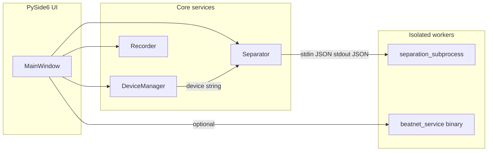

# Architecture Patterns — Windows Integration with macOS Design

**Domain:** Cross-platform desktop stem separation (PySide6, PyTorch, audio-separator)  
**Researched:** 2026-04-01  
**Scope:** How Windows should integrate **device management**, **subprocess separation**, and **recording backends** with the existing macOS-oriented architecture (see `.planning/codebase/ARCHITECTURE.md`).

## Recommended Architecture (Cross-Platform)

The codebase is already a **layered desktop app**: PySide6 UI → `AppContext` → singleton domain services (`core/`), with **subprocess isolation** for heavy ML and optional **out-of-process helpers** (BeatNet). Windows should **not** fork the high-level pattern; it should add **platform shims** behind the same abstractions.

### Component Boundaries

| Component | Responsibility | macOS today | Windows integration |
|-----------|----------------|-------------|---------------------|
| **`DeviceManager`** (`core/device_manager.py`) | PyTorch device probe, selection, memory hints | MPS > CUDA > CPU | **CUDA > CPU** (MPS absent). Same class: priority logic already skips unavailable backends. |
| **`Separator` + worker** (`core/separator.py`, `core/separation_subprocess.py`) | Chunking, retries, JSON IPC to child that runs audio-separator | `start_new_session` + `LSUIElement` when frozen | Reuse **identical** stdin/stdout JSON protocol and `cwd=output_dir`. Omit Dock-hiding env flags (not applicable). Optional: `CREATE_NO_WINDOW` / console attachment policy for packaged builds. |
| **`Recorder`** (`core/recorder.py`) | Capture system/input audio, level metering, file output | ScreenCaptureKit helper, BlackHole + SoundCard | **New backends** in parallel modules (e.g. WASAPI loopback, optional virtual-cable path). Same public API: start/stop, buffers, `RecordingInfo`. |
| **Beat service client** (`utils/beat_service_client.py`) | Subprocess + JSON for BeatNet | macOS binary in bundle | Ship **`beatnet_service.exe`** (or equivalent) and resolve path like macOS; `_terminate_process` already branches off `SIGINT` on win32. |
| **Bootstrap** (`main.py`) | Single instance, FFmpeg PATH, splash | `fcntl` file lock | **Replace** Unix-only lock with a Windows implementation (`QLocalServer` / named mutex / `msvcrt`+lock file — pick one and keep behavior: one instance). |
| **Packaging** (`packaging/`) | PyInstaller, bundled `bin/`, helpers | DMG, screencapture_tool, beatnet_service | Windows installer/EXE, bundle FFmpeg, **no** ScreenCaptureKit; add loopback helper DLLs only if required by chosen backend. |

### Data Flow (Unchanged Semantics)

1. **Startup:** Resolve `USER_DIR` / `sys._MEIPASS` → optional dependency check → **single-instance gate (platform-specific)** → `MainWindow` via `AppContext`.
2. **Separation:** UI → `Separator.separate()` → **subprocess** `run_separation_subprocess(...)` with `device` from `DeviceManager` → JSON on stdout → stems on disk. **Flow is OS-agnostic** if paths and executable resolution are correct under PyInstaller on Windows.
3. **Inference device:** `DeviceManager.get_device()` / `set_device()` → passed into subprocess params. On Windows, user-visible behavior should match macOS: prefer GPU when available, **CPU fallback** via existing `config.RETRY_STRATEGIES` / `ErrorHandler` patterns.
4. **Recording:** UI → `Recorder` → **backend strategy** (macOS: SCK or BlackHole; Windows: loopback and/or virtual input) → same downstream pipeline (trim silence, file handoff to separation queue).

## Patterns to Follow

### 1. Keep one `DeviceManager`, platform-aware priority (minimal change)

`_select_best_device()` already implements **MPS > CUDA > CPU**. On Windows, MPS is never available, so **CUDA wins when `torch.cuda.is_available()`**, else CPU. **Recommendation:** Optionally make priority explicit with `platform.system()` for clarity and future Intel/XPU entries; behavior should stay **one codepath**, not a Windows-specific subclass, unless Windows gains multi-GPU UX.

### 2. Subprocess separation: same contract, OS-specific **process flags only**

The separation worker is intentionally **not** the GUI (`STEMSEPARATOR_SUBPROCESS=1`). Windows should use the same **JSON IPC** and **working directory** fix already applied for frozen bundles. macOS-only kwargs (`start_new_session`, `LSUIElement`) are **additive** and should not be duplicated on Windows; document that **no Dock equivalent is required**.

### 3. Recording: **strategy + optional native helper** (mirror macOS)

macOS uses `core/screencapture_recorder.py` (ScreenCaptureKit) and SoundCard/BlackHole. Windows parity should follow the same **two-tier** approach:

- **Preferred:** System loopback without a third-party driver where feasible (e.g. WASAPI loopback — exact library choice is a **phase-level** decision; implement behind a small interface used by `Recorder`).
- **Fallback:** Virtual audio device (VB-Cable / similar), analogous to BlackHole, with **installer/detect** UX parallel to `BlackHoleInstaller` (could be a shared “virtual device helper” abstraction with platform implementations).

Extend `RecordingBackend` (or add a parallel enum member) so **AUTO** resolves per OS without breaking callers.

### 4. BeatNet: binary path resolution only

The client already handles Windows **termination** differently from POSIX signals. The **architecture** gap is packaging: a Windows-built service executable next to the app, same JSON protocol.

## Anti-Patterns to Avoid

- **Duplicating** `Separator` or `run_separation_subprocess` for Windows — increases drift and bug surface.
- **Embedding** WASAPI/COM logic directly in `Recorder` without extraction — will complicate testing and macOS maintenance.
- **Assuming** `sounddevice` alone captures “system audio” on Windows — loopback often needs **explicit** APIs or drivers; treat as a dedicated backend module.

## Scalability / Maintenance

| Concern | macOS | Windows |
|---------|-------|---------|
| GPU memory | MPS unified memory heuristics | CUDA `get_device_properties` / `empty_cache` (already partially used) |
| CI | pytest on macOS | Add Windows job for import/smoke + subprocess separation test |
| Long files | Chunking + subprocess timeout | Same; verify path length and temp dir under `%TEMP%` |

## Suggested Build Order for the Port

Order respects **dependencies**: bootstrap and inference before optional recording polish.

1. **Bootstrap parity** — `USER_DIR`, frozen `PATH` for FFmpeg, **Windows single-instance lock** (replace `fcntl` usage in `main.py`). *Unblocks running one copy reliably.*
2. **Windows PyInstaller spec + artifact** — Bundle layout mirrors macOS (`bin/`, models path). *Proves frozen `sys.executable` and `cwd` for workers.*
3. **Separation subprocess E2E** — Run frozen or dev worker on Windows with CUDA and CPU; confirm JSON IPC and file outputs. *Core product path.*
4. **`DeviceManager` validation** — CUDA wheel + driver matrix documented; UI shows `cuda` vs `cpu` like macOS. *Little code change if PyTorch stack is correct.*
5. **Playback** — Confirm `sounddevice`/PortAudio on Windows for monitoring (existing player paths). *Table-stakes UX.*
6. **Recording backends** — Implement Windows loopback (and optional virtual-cable path), wire into `Recorder` AUTO selection. *Feature parity (B) from PROJECT.md.*
7. **BeatNet service** — Build and package Windows `beatnet_service`, align discovery in `beat_service_client`. *Loop/grid features.*
8. **CI + manual test matrix** — Windows workflow for tests; document driver/virtual-audio install where required.

## Sources

- `.planning/PROJECT.md` — Windows port scope, CUDA + CPU fallback, recording parity.  
- `.planning/codebase/ARCHITECTURE.md` — Layers, data flow, subprocess and recorder roles.  
- `core/device_manager.py`, `core/separator.py`, `core/recorder.py`, `main.py`, `utils/beat_service_client.py` — implementation ground truth.  

**Confidence:** **HIGH** for separation/device subprocess alignment (directly reflected in code). **MEDIUM** for exact Windows recording API choice (library/driver selection should be validated in a dedicated implementation phase).
